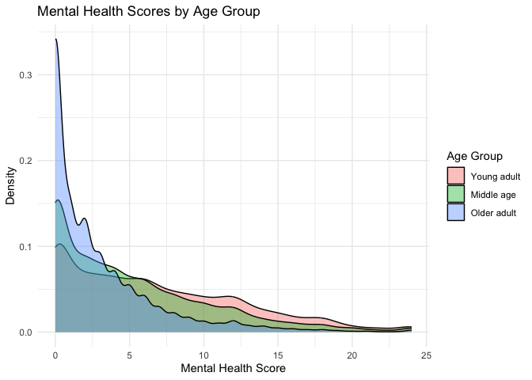
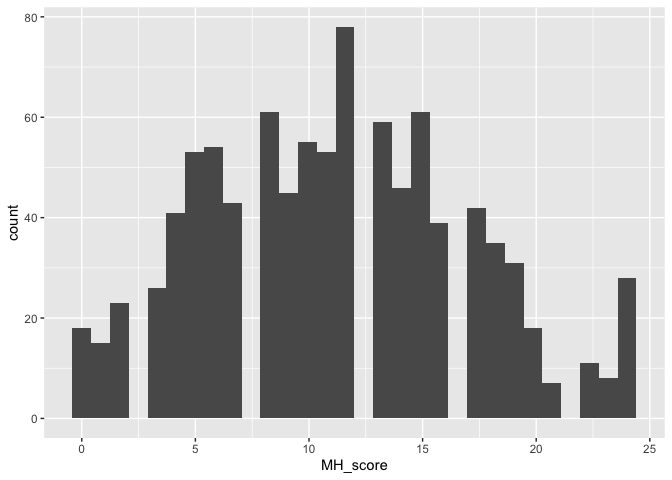
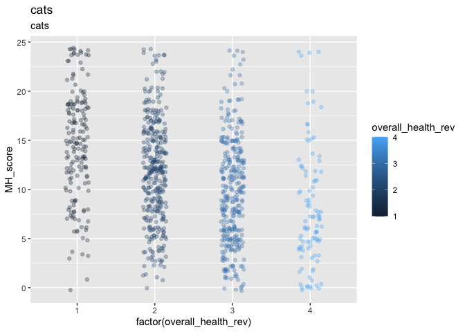
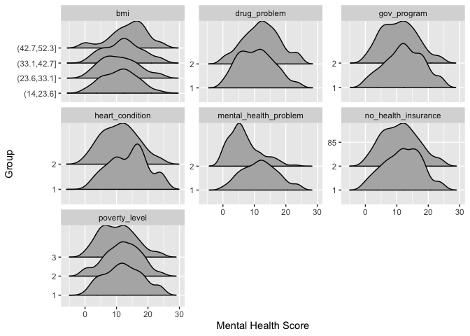
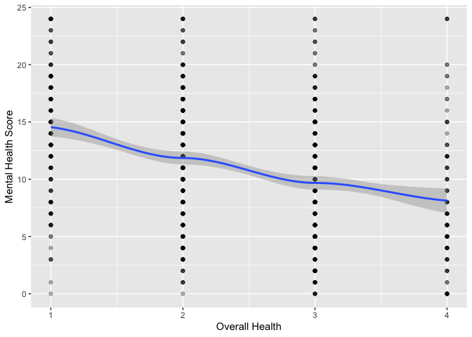
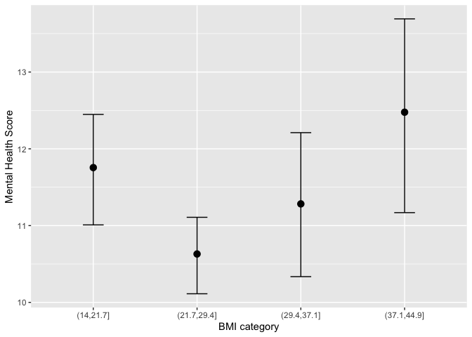
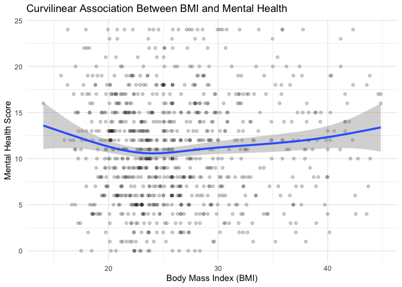

Portfolio 2
================
Insert your name here
Insert date here

> The projects should be numbered consecutively (i.e., in the order in
> which you began them), and should include for each project a
> description of the goal, the product (computer program, hand graph,
> computer graph, etc.), the data, and some interpretation. Reports must
> be reproducible and of high quality in terms of writing, grammar,
> presentation, etc.

Project Description

First, I load all the libraries I think I might use (even if they go
unused, I prefer this over having to check the libraries on and on as I
go)

``` r
library(dplyr)      
```

    ## 
    ## Attaching package: 'dplyr'

    ## The following objects are masked from 'package:stats':
    ## 
    ##     filter, lag

    ## The following objects are masked from 'package:base':
    ## 
    ##     intersect, setdiff, setequal, union

``` r
library(ggplot2)    
library(survey)     
```

    ## Loading required package: grid

    ## Loading required package: Matrix

    ## Loading required package: survival

    ## 
    ## Attaching package: 'survey'

    ## The following object is masked from 'package:graphics':
    ## 
    ##     dotchart

``` r
library(tidyverse)   
```

    ## ── Attaching core tidyverse packages ──────────────────────── tidyverse 2.0.0 ──
    ## ✔ forcats   1.0.1     ✔ stringr   1.6.0
    ## ✔ lubridate 1.9.4     ✔ tibble    3.3.1
    ## ✔ purrr     1.2.1     ✔ tidyr     1.3.2
    ## ✔ readr     2.1.6

    ## ── Conflicts ────────────────────────────────────────── tidyverse_conflicts() ──
    ## ✖ tidyr::expand() masks Matrix::expand()
    ## ✖ dplyr::filter() masks stats::filter()
    ## ✖ dplyr::lag()    masks stats::lag()
    ## ✖ tidyr::pack()   masks Matrix::pack()
    ## ✖ tidyr::unpack() masks Matrix::unpack()
    ## ℹ Use the conflicted package (<http://conflicted.r-lib.org/>) to force all conflicts to become errors

``` r
library(rstatix)   # in case
```

    ## 
    ## Attaching package: 'rstatix'
    ## 
    ## The following object is masked from 'package:stats':
    ## 
    ##     filter

``` r
library(lm.beta)
library(haven)
library(ggplot2)
library(ggridges)

load("NSDUH_2024.Rdata")
```

``` r
# Clean mental health score
df <- NSDUH_2024 %>%
  mutate(
    MH_score = as.numeric(KSSLR6MONED),
    MH_score = ifelse(MH_score %in% c(94, 97, 98, 99), NA, MH_score)
  ) %>%
  # Remove rows with missing MH_score or AGE3
  filter(!is.na(MH_score), !is.na(AGE3))
```

``` r
# Recode AGE3 into 3 broad adult age groups
df <- df %>%
  # Remove missing MH_score or AGE3
  filter(!is.na(MH_score), !is.na(AGE3)) %>%
  mutate(
    AGE_GROUP = case_when(
      AGE3 %in% 4:6  ~ "Young adult",   # 18–29
      AGE3 %in% 7:9  ~ "Middle age",    # 30–64
      AGE3 == 10 | AGE3 == 11 ~ "Older adult"
    ),
    AGE_GROUP = factor(AGE_GROUP, levels = c("Young adult", "Middle age", "Older adult"))
  )

# Check counts
table(df$AGE_GROUP)
```

    ## 
    ## Young adult  Middle age Older adult 
    ##       13683       21753       10385

``` r
# Kruskal-Wallis test
kruskal.test(MH_score ~ AGE_GROUP, data = df)
```

    ## 
    ##  Kruskal-Wallis rank sum test
    ## 
    ## data:  MH_score by AGE_GROUP
    ## Kruskal-Wallis chi-squared = 3412.5, df = 2, p-value < 2.2e-16

``` r
# Effect size
kruskal_effsize(df, MH_score ~ AGE_GROUP)
```

    ## # A tibble: 1 × 5
    ##   .y.          n effsize method  magnitude
    ## * <chr>    <int>   <dbl> <chr>   <ord>    
    ## 1 MH_score 45821  0.0744 eta2[H] moderate

``` r
# Pairwise Wilcoxon comparisons
pairwise.wilcox.test(df$MH_score, df$AGE_GROUP, p.adjust.method = "bonferroni")
```

    ## 
    ##  Pairwise comparisons using Wilcoxon rank sum test with continuity correction 
    ## 
    ## data:  df$MH_score and df$AGE_GROUP 
    ## 
    ##             Young adult Middle age
    ## Middle age  <2e-16      -         
    ## Older adult <2e-16      <2e-16    
    ## 
    ## P value adjustment method: bonferroni

``` r
# let's plot it!
ggplot(df, aes(x = MH_score, fill = AGE_GROUP)) +
  geom_density(alpha = 0.4) +
  labs(
    x = "Mental Health Score",
    y = "Density",
    fill = "Age Group",
    title = "Mental Health Scores by Age Group"
  ) +
  theme_minimal()
```

<!-- -->

``` r
# lots of cleaning to do
young_adults <- df %>%
  filter(AGE_GROUP == "Young adult")

young_adults <- young_adults %>%
  mutate(
    POVERTY3   = ifelse(POVERTY3 %in% c(94, 97, 98, 99), NA, POVERTY3),
    HRTCONDEV2 = ifelse(HRTCONDEV2 %in% c(94, 97, 98, 99), NA, HRTCONDEV2),
    BMI2       = ifelse(BMI2 %in% c(94, 97, 98, 99), NA, BMI2),
    CASURCVR   = ifelse(CASURCVR %in% c(94, 97, 98, 99), NA, CASURCVR),
    CAMHPROB   = ifelse(CAMHPROB %in% c(94, 97, 98, 99), NA, CAMHPROB),
    HEALTH2    = ifelse(HEALTH2 %in% c(94, 97, 98, 99), NA, HEALTH2),
    IRSEX      = ifelse(IRSEX %in% c(94, 97, 98, 99), NA, IRSEX),
    HLCNOTYR   = ifelse(HLCNOTYR %in% c(94, 97, 98, 99), NA, HLCNOTYR),
    GOVTPROG   = ifelse(GOVTPROG %in% c(94, 97, 98, 99), NA, GOVTPROG)
  ) %>%
  rename(
    poverty_level = POVERTY3,
    heart_condition = HRTCONDEV2,
    bmi = BMI2,
    drug_problem = CASURCVR,
    mental_health_problem = CAMHPROB,
    overall_health = HEALTH2,
    gender = IRSEX,
    no_health_insurance = HLCNOTYR,
    gov_program = GOVTPROG
  ) %>%
   # Convert categorical predictors to factors
  mutate(
    heart_condition = factor(heart_condition),
    drug_problem = factor(drug_problem),
    mental_health_problem = factor(mental_health_problem),
    gender = factor(gender),
    no_health_insurance = factor(no_health_insurance),
    gov_program = factor(gov_program)
  ) %>%
  # Remove any rows with missing values in DV or predictors
  drop_na(MH_score, poverty_level, heart_condition, bmi, drug_problem,
          mental_health_problem, overall_health, gender, no_health_insurance, gov_program)

# now we save this
young_adults <- young_adults %>%
  select(MH_score, poverty_level, heart_condition, bmi, drug_problem,
         mental_health_problem, overall_health, gender, no_health_insurance, gov_program)
```

``` r
# let's take a peak
head(young_adults)
```

    ## # A tibble: 6 × 10
    ##   MH_score poverty_level heart_condition   bmi drug_problem
    ##      <dbl>         <dbl> <fct>           <dbl> <fct>       
    ## 1       15             3 2                28.9 1           
    ## 2        4             1 2                29.0 2           
    ## 3        9             3 1                19.7 1           
    ## 4       16             3 1                20.1 2           
    ## 5       11             3 2                32.5 2           
    ## 6       20             3 2                18.9 2           
    ## # ℹ 5 more variables: mental_health_problem <fct>, overall_health <dbl>,
    ## #   gender <fct>, no_health_insurance <fct>, gov_program <fct>

``` r
summary(young_adults)
```

    ##     MH_score    poverty_level   heart_condition      bmi        drug_problem
    ##  Min.   : 0.0   Min.   :1.000   1 : 42          Min.   :14.04   1:631       
    ##  1st Qu.: 7.0   1st Qu.:1.000   2 :908          1st Qu.:21.95   2:319       
    ##  Median :11.0   Median :3.000   85:  0          Median :25.09               
    ##  Mean   :11.2   Mean   :2.277                   Mean   :26.65               
    ##  3rd Qu.:15.0   3rd Qu.:3.000                   3rd Qu.:29.51               
    ##  Max.   :24.0   Max.   :3.000                   Max.   :52.25               
    ##  mental_health_problem overall_health  gender  no_health_insurance gov_program
    ##  1:842                 Min.   :1.000   1:430   1 :132              1:228      
    ##  2:108                 1st Qu.:2.000   2:520   2 :817              2:722      
    ##                        Median :3.000           85:  1                         
    ##                        Mean   :2.627                                          
    ##                        3rd Qu.:3.000                                          
    ##                        Max.   :4.000

``` r
# information about vars; poverty three levels, heart condition and health insurance is yes no, drug problem and MH
# is also binary, overall health ordinal 5, 

# this loks pretty normally distributed among young people
ggplot(young_adults, aes(MH_score)) +
  geom_histogram(bins = 30)
```

<!-- -->

``` r
# mutate so it makes more sense
young_adults <- young_adults %>%
  mutate(overall_health_rev = recode(overall_health,
                                     `1` = 4,
                                     `2` = 3,
                                     `3` = 2,
                                     `4` = 1
  ))

# relationship btwn overall and MH 
ggplot(young_adults, aes(factor(overall_health_rev), MH_score)) +
  geom_jitter(aes(colour = overall_health_rev), width = .15, alpha = .3) +
  labs(title = "cats",
       subtitle = "cats",
       )
```

<!-- -->

``` r
# why type each var is
# was having issues with certain plots so best way to deal 
sapply(young_adults, class)
```

    ##              MH_score         poverty_level       heart_condition 
    ##             "numeric"             "numeric"              "factor" 
    ##                   bmi          drug_problem mental_health_problem 
    ##             "numeric"              "factor"              "factor" 
    ##        overall_health                gender   no_health_insurance 
    ##             "numeric"              "factor"              "factor" 
    ##           gov_program    overall_health_rev 
    ##              "factor"             "numeric"

``` r
cat_df <- young_adults %>%
  mutate(
    poverty_level = factor(poverty_level),
    bmi = cut(bmi, breaks = 4)
  ) %>%
  pivot_longer(
    cols = c(poverty_level, heart_condition, bmi,
             drug_problem, mental_health_problem,
             no_health_insurance, gov_program),
    names_to = "predictor",
    values_to = "value"
  )

num_df <- young_adults %>%
  pivot_longer(
    cols = c(overall_health_rev),
    names_to = "predictor",
    values_to = "value"
  )
```

``` r
ggplot(cat_df, aes(x = MH_score, y = value)) +
  geom_density_ridges2() +
  facet_wrap(~ predictor, scales = "free_y") +
  labs(y = "Group", x = "Mental Health Score")
```

    ## Picking joint bandwidth of 1.88

    ## Picking joint bandwidth of 1.51

    ## Picking joint bandwidth of 1.59

    ## Picking joint bandwidth of 1.95

    ## Picking joint bandwidth of 1.44

    ## Picking joint bandwidth of 1.66
    ## Picking joint bandwidth of 1.66

<!-- -->

``` r
ggplot(num_df, aes(x = value, y = MH_score)) +
  geom_point(alpha = .3) +
  geom_smooth(method = "loess") +
  labs(x = "Overall Health", y = "Mental Health Score")
```

    ## `geom_smooth()` using formula = 'y ~ x'

    ## Warning in simpleLoess(y, x, w, span, degree = degree, parametric = parametric,
    ## : pseudoinverse used at 0.985

    ## Warning in simpleLoess(y, x, w, span, degree = degree, parametric = parametric,
    ## : neighborhood radius 2.015

    ## Warning in simpleLoess(y, x, w, span, degree = degree, parametric = parametric,
    ## : reciprocal condition number 1.3487e-16

    ## Warning in simpleLoess(y, x, w, span, degree = degree, parametric = parametric,
    ## : There are other near singularities as well. 4.0602

    ## Warning in predLoess(object$y, object$x, newx = if (is.null(newdata)) object$x
    ## else if (is.data.frame(newdata))
    ## as.matrix(model.frame(delete.response(terms(object)), : pseudoinverse used at
    ## 0.985

    ## Warning in predLoess(object$y, object$x, newx = if (is.null(newdata)) object$x
    ## else if (is.data.frame(newdata))
    ## as.matrix(model.frame(delete.response(terms(object)), : neighborhood radius
    ## 2.015

    ## Warning in predLoess(object$y, object$x, newx = if (is.null(newdata)) object$x
    ## else if (is.data.frame(newdata))
    ## as.matrix(model.frame(delete.response(terms(object)), : reciprocal condition
    ## number 1.3487e-16

    ## Warning in predLoess(object$y, object$x, newx = if (is.null(newdata)) object$x
    ## else if (is.data.frame(newdata))
    ## as.matrix(model.frame(delete.response(terms(object)), : There are other near
    ## singularities as well. 4.0602

<!-- -->

``` r
cor(num_df$value, num_df$MH_score, use = "complete.obs")
```

    ## [1] -0.3437079

``` r
# the bmi one also really stood out to me

# kick out unrealistic scores
young_adults_filtered <- young_adults %>% filter(bmi < 45)

ggplot(young_adults_filtered, aes(x = bmi, y = MH_score)) +
  geom_point(alpha = .25) +
  geom_smooth(method = "loess") +
  labs(x = "BMI", y = "Mental Health Score")
```

    ## `geom_smooth()` using formula = 'y ~ x'

<!-- -->

``` r
# 
young_adults_filtered %>%
  mutate(bmi_cat = cut(bmi, breaks = 4)) %>%
  ggplot(aes(x = bmi_cat, y = MH_score)) +
  stat_summary(fun = mean, geom = "point", size = 3) +
  stat_summary(fun.data = mean_cl_boot, geom = "errorbar", width = .2) +
  labs(x = "BMI category", y = "Mental Health Score")
```

<!-- -->

``` r
# is there really a u shaped curve? - yes
lm(MH_score ~ bmi + I(bmi^2), data = young_adults_filtered)
```

    ## 
    ## Call:
    ## lm(formula = MH_score ~ bmi + I(bmi^2), data = young_adults_filtered)
    ## 
    ## Coefficients:
    ## (Intercept)          bmi     I(bmi^2)  
    ##    18.98204     -0.61063      0.01129

``` r
ggplot(young_adults_filtered, aes(x = bmi, y = MH_score)) +
  geom_point(alpha = .2) +
  geom_smooth(method = "gam", formula = y ~ s(x), size = 1.2) +
  theme_minimal() +
  labs(
    title = "Curvilinear Association Between BMI and Mental Health",
    x = "Body Mass Index (BMI)",
    y = "Mental Health Score"
  )
```

    ## Warning: Using `size` aesthetic for lines was deprecated in ggplot2 3.4.0.
    ## ℹ Please use `linewidth` instead.
    ## This warning is displayed once per session.
    ## Call `lifecycle::last_lifecycle_warnings()` to see where this warning was
    ## generated.

<!-- -->

``` r
# more cool sutff
young_adults_filtered <- young_adults_filtered %>%
  mutate(
    overall_health_cat = factor(overall_health_rev),
    poverty_level = factor(poverty_level)
  )

ggplot(young_adults_filtered, 
       aes(x = bmi, y = MH_score, color = factor(overall_health_rev))) +
  geom_point(alpha = 0.3) +
  geom_smooth(method = "gam", formula = y ~ s(x), se = FALSE) +
  labs(
    x = "BMI",
    y = "Mental Health Score",
    color = "Overall Health",
    title = "BMI vs MH, colored by Overall Health"
  ) +
  theme_minimal()
```

<!-- -->

``` r
# Plot BMI vs Mental Health by gender
ggplot(young_adults_filtered, aes(x = bmi, y = MH_score, color = gender)) +
  geom_point(alpha = 0.3) +
  geom_smooth(method = "gam", formula = y ~ s(x), se = FALSE) +
  theme_minimal() +
  labs(
    title = "BMI vs Mental Health by Gender",
    x = "Body Mass Index (BMI)",
    y = "Mental Health Score",
    color = "Gender"
  )
```

<!-- -->
